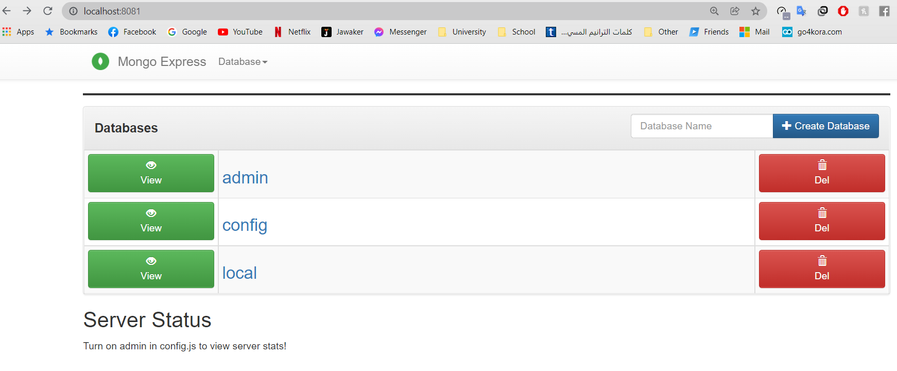
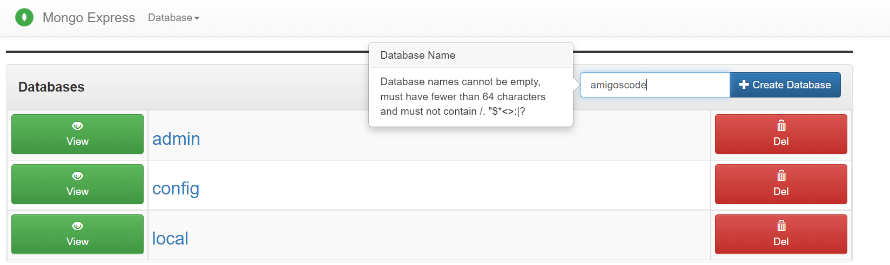
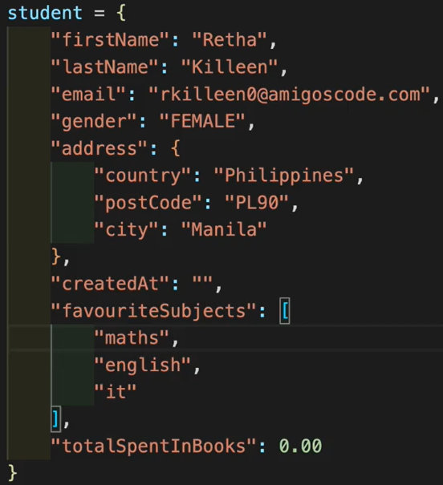
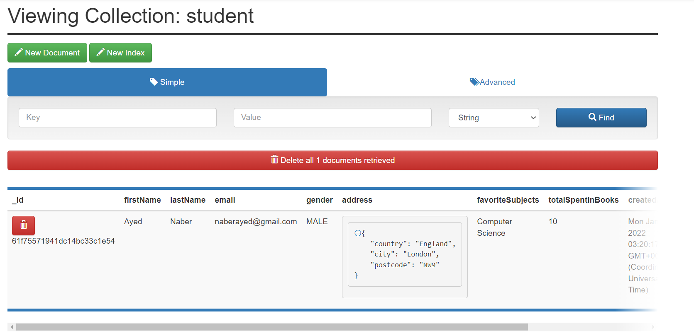

# Building REST API using Spring Boot and MongoDB

To get the files needed for this Spring Boot application, we will navigate to start.spring.io, where we will add the following dependencies:
- Spring Web
- Spring Data MongoDB (NoSQL and Testing (2 dependencies))
- Lombok


## Creating a Docker container for our MongoDB Database
Now, in order to use MongoDB in this case, we will load that from a Docker container.
Therefore, we must make sure that we download Docker Desktop, and then once that is intalled,
visit the following URL: https://raw.githubusercontent.com/amigoscode/mongodb-course/main/docker-compose.yaml

We copy the contents of that file and place it in a file called `docker-compose.yaml`

We place that inside our parent directory, and then we click the green button to run the container, which runs the `docker compose` command,
and starts MongoDB. Another option than running it from the UI like we did is typing the following in the terminal:

`docker compose -f docker-compose.yaml -d`, where -d means detached.

Another part of the `docker-compose.yaml` file is mongoexpress, where if we visit `localhost:8081`, we see our database up and running!


## Creating our Database
Inside src/main/resources, in our `application.properties` file,
we define the following properties for our database:
The username and password are also defined as environment variables in our docker compose yaml file.

```
spring.data.mongodb.authentication-database=admin
spring.data.mongodb.username=rootuser
spring.data.mongodb.password=rootpass
spring.data.mongodb.database=amigoscode
spring.data.mongodb.port=27017
spring.data.mongodb.host=localhost
```
As for the database name, we defined it to be "amigoscode", so we go to our Mongo Express, and we create a database with that name.


Now that we defined a connection with our database, if we run our Spring Boot application, it will run successfully, unlike before where it showed a few errors.

## Defining Collections/Documents in our Database
We are trying to have entries in our new database that will look like this:

Therefore, in our src/main/java/com.example.demomongo, we will create a Student class and we will define all of the above properties.
Note that Gender was defined as an enum class, and Address was also defined as a separate class (since it is a nested document).

Any document in MongoDB needs to have an id, and therefore we go back to our student class,
and we add `@Document` to specify that each student object will signify a document in our database, as well as we add an id field and annotate it with `@Id`.

Now, to add data to it, we need a **Repository**.

## Mongo Repository
In order to create this repository, we will create an Interface in the same direotory as our other java classes.
This interface will be called `StudentRepository`, and it will extend `MongoRepository<Student, String>`, the Student is the object type, and
String is the data type of the Student's id.

Let us go to our `DemomongoApplication.java`, which is our main Spring Boot application file, and in it,
we will define a bean, and a command line runner. Inside that, we define an instance od a student. We go back to our Student class
and we create a constructor without the ID.

We will give all of the required parameters to our student instance. We also used the `@AllArgsConstructor` in our Address class.

Then we use the repository we defined, and use the insert method to add it to our database.

Now once we run our application, our entry will be added to the database. Let us check our application:


## Making Email Unique (Adding an Index)
At this state, if we try adding another student with the same details, then another entry in the DB will be added but with
a different autogenerated ID, and therefore, we will change the email to be **unique** by **adding an index**. This
will also make it faster to search by email. We do this by adding this line above the email field: `@Indexed(unique = true)` in `Student.java`.

Also, in order to enable the automatic creation of indices, we add the following line to our `application.properties` file:

Now, if we run our application, we will run into an error, since we already have a student with the same email defined.

## Learning about Writing Custom Queries
We want to add custom queries, so we can some logic if an email does not exist, as opposed to our whole Spring Boot applicaiton to crash and not run.


